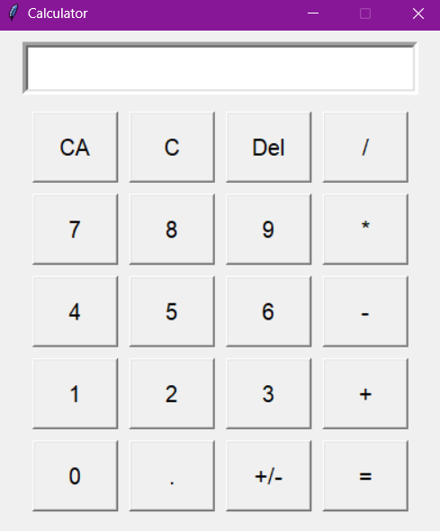

# tkCalc

**Desenvolvimento de uma calculadora com interface gráfica semelhante à calculadora padrão do Windows.**

Este projeto utiliza **Tkinter** para criar a interface gráfica e **Pillow** para a manipulação de elementos gráficos. A calculadora permite a inserção de números e operadores, realiza cálculos e manipula sinais e entradas.

## Requisitos

- **Python** instalado

## Instruções de Uso

1. **Instalação das Bibliotecas**
   - Execute o script `install_libraries.cmd`. Este script instalará as bibliotecas necessárias e perguntará se você deseja iniciar a aplicação.

2. **Início da Aplicação**
   - Após a instalação, inicie a aplicação executando o script `run_script.vbs`.

